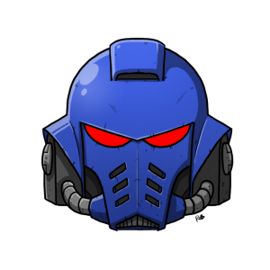

<div align="center">



# Space Marine Voice

**Voice changer em tempo real que transforma sua voz em um Astartes de Warhammer 40k.**

[](https://www.python.org/downloads/)
[](https://github.com/spotify/pedalboard)
[](https://vb-audio.com/Cable/)
[](#-testes)
[](#-licença)

CLI · Python 3.11+ · `pedalboard` · `sounddevice` · `typer` · `rich`

</div>

---

## Sumário

- [Visão geral](#-visão-geral)
- [Demo (cadeia de efeitos)](#-demo-cadeia-de-efeitos)
- [Pré-requisitos](#-pré-requisitos)
- [Instalação](#-instalação)
- [Uso](#-uso)
- [Configurando o Discord (ou OBS, jogos…)](#-configurando-o-discord-ou-obs-jogos)
- [A cadeia de 9 efeitos](#-a-cadeia-de-9-efeitos)
- [Personalização (`config.yaml`)](#-personalização-configyaml)
- [Arquitetura](#-arquitetura)
- [Testes](#-testes)
- [Limitações conhecidas](#-limitações-conhecidas)
- [Roadmap](#-roadmap)
- [Contribuindo](#-contribuindo)
- [Créditos](#-créditos)
- [Licença](#-licença)

---

## Visão geral

`space-marine` é um voice changer em **tempo real** que aplica uma cadeia
fixa de DSP à sua voz — modelada fielmente sobre o tutorial Adobe Audition
para som de Astartes (Space Marine 2 / cinematics oficiais) — e roteia o
áudio processado para um dispositivo virtual (**VB-CABLE**), pronto para
ser consumido como microfone por Discord, OBS, jogos, Zoom, etc.

> **Um único efeito, fixo.** Sem presets de robô, demônio ou alien.
> Sem clonagem por IA. Apenas a estética de capacete fechado, voz grave e
> ressonância metálica.

### Características

- **Baixa latência** — alvo < 30 ms (configurável, default `block_size=256` @ 44.1 kHz ≈ 5.8 ms por bloco)
- **Cadeia DSP fiel** — 9 estágios + limiter, na ordem exata do tutorial
- **100% configurável via YAML** — edite e re-rode, sem tocar no código
- **Auto-detecta o VB-CABLE** — se não estiver instalado, falha com mensagem clara
- **Testado** — 9 testes cobrindo loader, validação e a cadeia DSP
- **CLI limpa** — `devices`, `run`, `process`, `show-chain` com `rich`

---

## Demo (cadeia de efeitos)

```text
$ space-marine show-chain
Space Marine chain · config.yaml
├── 1. Pitch shift · semitones=-1.0, formant +1.5 dB @ 500.0 Hz
├── 2. Echo x2 · delay=28.0 ms, fb=0.6, mix=0.5
│   ├── low_shelf -3.0 dB @ 200.0 Hz
│   ├── mid_peak -4.0 dB @ 3000.0 Hz (q=1.0)
│   └── high_shelf -7.0 dB @ 7000.0 Hz
├── 3. Fat Snare
│   ├── peak +4.0 dB @ 200.0 Hz (q=1.0)
│   └── peak +2.0 dB @ 5000.0 Hz (q=1.2)
├── 4. Home Theater
│   ├── low_shelf +4.0 dB @ 80.0 Hz
│   └── high_shelf +2.0 dB @ 10000.0 Hz
├── 5. Boomy Kick · peak +5.0 dB @ 70.0 Hz (q=0.8)
├── 6. Bright and Punchy
│   ├── compressor th=-18.0 dB, ratio=3.5, atk=5.0 ms, rel=80.0 ms
│   └── presence peak +3.0 dB @ 4000.0 Hz (q=1.0)
├── 7. Possible Bass · low_shelf +3.0 dB @ 120.0 Hz
├── 8. Subtle Clarity · peak +2.0 dB @ 6000.0 Hz (q=1.5)
├── 9. DeEsser Light · peak -3.0 dB @ 7000.0 Hz (q=3.0)
└── Limiter · threshold=-1.0 dB, release=60.0 ms
```

---

## Pré-requisitos

| Requisito                          | Versão / Origem                                                   |
|------------------------------------|-------------------------------------------------------------------|
| **Python**                         | 3.11 ou superior                                                  |
| **Sistema operacional**            | Windows (testado); macOS/Linux funcionam para `process` offline   |
| **VB-CABLE Virtual Audio Device**  | Grátis · <https://vb-audio.com/Cable/> · **reinicie após instalar** |
| **PortAudio**                      | Vem com `sounddevice` no Windows; em Linux: `apt install libportaudio2` |

> O programa **não instala** o VB-CABLE — só o detecta. Se não encontrar,
> aborta com mensagem clara apontando para o link de download.

---

## Instalação

```bash
# 1. Clone
git clone https://github.com/GCarin1/space-marine-voicemic.git
cd space-marine-voicemic

# 2. (Recomendado) Ambiente virtual
python -m venv .venv
# Windows PowerShell:
.\.venv\Scripts\Activate.ps1
# Linux/macOS:
source .venv/bin/activate

# 3. Instale em modo editável (recomendado — registra o comando `space-marine`)
pip install -e .

# 4. (Opcional) Dependências de testes
pip install -e .[dev]
```

> Se preferir o estilo `requirements.txt`, há um na raiz do projeto:
> ```bash
> pip install -r requirements.txt          # runtime
> pip install -r requirements-dev.txt      # runtime + pytest
> ```
> Note que esse modo **não** registra o comando `space-marine` no PATH; use
> `python -m space_marine.cli ...` ou prefira `pip install -e .`.

Após instalar em modo editável, o comando `space-marine` fica disponível no PATH.

---

## Uso

### Listar dispositivos de áudio

```bash
space-marine devices
```

Mostra uma tabela com índice, nome, canais de entrada/saída e API de cada
dispositivo. Use isso para descobrir o índice do seu microfone.

### Rodar em tempo real (caso típico)

```bash
space-marine run
```

Auto-detecta seu microfone padrão como **entrada** e o `CABLE Input`
do VB-CABLE como **saída**. Fale, e a sua voz processada vai para o
cabo virtual. Pressione `Ctrl-C` para parar.

### Forçar dispositivos específicos

```bash
space-marine run --input 1 --output 7
```

Útil se você tem múltiplas interfaces ou quer rotear para um dispositivo
diferente do VB-CABLE (ex.: para monitorar nos fones diretamente).

### Processar um arquivo `.wav` offline

```bash
space-marine process minha_voz.wav minha_voz_space_marine.wav
```

Aplica a cadeia inteira no arquivo. Excelente para testar configurações
sem precisar falar ao vivo.

### Inspecionar a cadeia carregada

```bash
space-marine show-chain
```

Imprime a árvore de efeitos com todos os parâmetros lidos de
`config.yaml` — confira o que está prestes a rodar antes de abrir o stream.

### Debug

Em qualquer comando, passe `--debug` para ver o stack trace completo em
caso de erro. Sem `--debug`, os erros aparecem como mensagens curtas e
humanas.

---

## Configurando o Discord (ou OBS, jogos…)

Após instalar o VB-CABLE e rodar `space-marine run`:

1. **Discord** → User Settings → **Voice & Video**
2. **Input Device** → escolha **`CABLE Output (VB-Audio Virtual Cable)`**
3. (Opcional) Para **se ouvir** enquanto fala:
   - Windows: Painel de Som → aba **Gravação** → `CABLE Output` →
     Propriedades → aba **Ouvir** → marque "Ouvir este dispositivo" →
     reproduzir através do seu **fone** (nunca dos alto-falantes, vai
     causar feedback).

A mesma lógica vale para OBS (Mic/Aux Audio = `CABLE Output`), jogos com
seleção de mic, Zoom, Google Meet, etc.

---

## A cadeia de 9 efeitos

A ordem replica fielmente o tutorial Adobe Audition. Todos os parâmetros
são editáveis em `config.yaml`.

| #  | Estágio                | DSP                                          | Função                                                         |
|----|------------------------|----------------------------------------------|----------------------------------------------------------------|
| 1  | **Lower Pitch**        | `PitchShift(-1 st)` + peak +1.5 dB @ 500 Hz  | Voz mais grave; realce de formante anti "rato gigante"         |
| 2  | **Echo x2**            | `Delay(28 ms, fb=0.6, mix=0.5)` + EQ damping | **Coração do som**: ressonância de capacete fechado            |
| 3  | **Fat Snare**          | Peak +4 dB @ 200 Hz, +2 dB @ 5 kHz           | Reforço de corpo                                               |
| 4  | **Home Theater**       | LowShelf +4 dB @ 80 Hz, HighShelf +2 dB @ 10 kHz | Simula caixa grande / sub + ar                              |
| 5  | **Boomy Kick**         | Peak +5 dB @ 70 Hz, q=0.8                    | Peso em frequências de bumbo                                   |
| 6  | **Bright and Punchy**  | `Compressor(-18 dB, 3.5:1)` + peak +3 dB @ 4 kHz | Compressão + presença vocal                                |
| 7  | **Possible Bass**      | LowShelf +3 dB @ 120 Hz                      | Reforço de sub-bass                                            |
| 8  | **Subtle Clarity**     | Peak +2 dB @ 6 kHz, q=1.5                    | Articulação                                                    |
| 9  | **DeEsser Light**      | Peak -3 dB @ 7 kHz, q=3.0                    | Atenua sibilância                                              |
| —  | **Limiter**            | `Limiter(threshold=-1 dB)`                   | Trava saída a -1 dBFS — nada estoura                           |

> **Detalhe sobre o Echo x2:** cada repetição é seguida por um trio
> low-shelf / mid-peak / high-shelf que aproxima a "Successive Echo
> Equalization" do preset *Shower* do Audition — escurece as repetições
> e dá o timbre claustrofóbico de capacete blindado.

---

## Personalização (`config.yaml`)

Todo o comportamento da cadeia vive no `config.yaml` na raiz do projeto.
Edite os valores e rode `space-marine run` de novo — não é necessário
reiniciar nada além do programa.

Exemplos:

```yaml
# Voz mais grave (cuidado, pode virar caricatura abaixo de -3)
pitch:
  semitones: -2

# Echo mais "catedral"
echo:
  apply_times: 3
  delay_ms: 45
  feedback: 0.65

# Reduzir latência (custa CPU; default 256 já é confortável)
block_size: 128   # ~2.9 ms por bloco a 44.1 kHz
```

Após editar, valide com:

```bash
space-marine show-chain
```

Se houver erro no YAML, a mensagem aponta exatamente qual campo está
faltando ou inválido.

---

## Arquitetura

```
space-marine-voicemic/
├── config.yaml                  # Parâmetros da cadeia (editável)
├── prompt.md                    # Prompt original que originou o projeto
├── memoria.md                   # Diário de desenvolvimento
├── pyproject.toml               # Pacote + metadados + entry point
├── requirements.txt             # Dependências de runtime (alternativa ao install -e .)
├── requirements-dev.txt         # Runtime + pytest
├── LICENSE
├── README.md
├── src/space_marine/
│   ├── __init__.py
│   ├── cli.py                   # Typer + rich — comandos
│   ├── audio_engine.py          # sounddevice.Stream + process_file
│   ├── effects.py               # build_pedalboard(cfg) → Pedalboard
│   ├── devices.py               # Detecção de mic e VB-CABLE
│   └── config.py                # Loader/validator do YAML
└── tests/
    ├── test_config.py
    └── test_effects.py
```

**Fluxo em tempo real:**

```
[Microfone] → sounddevice.Stream → callback ─┐
                                             ▼
                              board(indata, sr, reset=False)
                                             │
                                             ▼
                              sounddevice.Stream → [CABLE Input]
                                                        │
                                                        ▼
                                                  [Discord / OBS]
                                                  reads CABLE Output
```

> O `reset=False` é **crítico**: garante que a cauda do Echo não seja
> truncada a cada bloco, preservando a ressonância metálica.

---

## Testes

```bash
pip install -e .[dev]
pytest -v
```

A suíte cobre:

- **`test_config.py`** — YAML malformado dá erro claro; campos
  obrigatórios ausentes citam o nome do campo; config padrão carrega.
- **`test_effects.py`** — cadeia preserva nº de samples, RMS > threshold,
  peak ≤ 1.0 (não clipa), `pitch.semitones=-1` desloca o fundamental
  do FFT na direção esperada.

---

## Limitações conhecidas

- **Pitch shift desativado em realtime por padrão.** `pedalboard.PitchShift`
  bufferiza áudio internamente e só libera com `reset=True` — comportamento
  documentado pelo Spotify. Isso o torna inutilizável em streams.
  Solução adotada: em `space-marine run` o estágio 1 é **pulado**; em
  `space-marine process` (offline) ele é aplicado normalmente (lá funciona
  perfeitamente porque o áudio inteiro é alimentado de uma vez). O realce
  de formante (+1.5 dB @ 500 Hz) é mantido em ambos os modos. Se quiser
  forçar o pitch shift em realtime, troque `pitch.realtime_enabled: true`
  no `config.yaml` — preparado para >1 s de silêncio inicial.
- **Latência depende da hostapi (Windows).** WASAPI dá tipicamente 5–20 ms;
  DirectSound vai a 200+ ms; MME é o pior caso. O auto-detect prefere
  WASAPI quando possível. Se rodar com `--input/--output` manuais, escolha
  índices com API "Windows WASAPI" (rode `space-marine devices`).
- **Formantes não preservados** pelo `PitchShift` original; o peak filter
  em 500 Hz compensa parcialmente. Para preservação real seria preciso
  um vocoder de fase ou um plugin VST externo.
- **DeEsser aproximado.** Implementado como peak filter estreito de
  -3 dB @ 7 kHz. Funciona para fala normal; pode não bastar em mics
  muito sibilantes.
- **Mono.** A cadeia trabalha em um canal — voz é mono na prática.
- **VB-CABLE é Windows-only** (oficialmente). macOS pode usar
  BlackHole ou Loopback; basta apontar `--output` para o índice
  equivalente.

---

## Roadmap

- [ ] Hot-reload do `config.yaml` com `watchdog`
- [ ] Indicador ao vivo de RMS / peak durante `run`
- [ ] Pacote `pipx`-instalável
- [ ] Suporte explícito a BlackHole (macOS) na auto-detecção
- [ ] Modo `process` em lote (diretório → diretório)

> Sugestões são bem-vindas — abra uma **Issue** com a tag `enhancement`.

---

## Contribuindo

1. Fork → branch (`feat/minha-feature` ou `fix/algum-bug`)
2. `pip install -e .[dev]`
3. Garanta `pytest -v` passando
4. Type hints em código novo, docstrings curtas
5. Pull request descrevendo **o que** mudou e **por quê**

### Estilo

- **Sem presets extras** (o projeto é deliberadamente um efeito só)
- **Sem GUI** (CLI por design)
- **Erros viram mensagens humanas**, stack trace só com `--debug`

---

## Créditos

- Cadeia de efeitos adaptada do tutorial **Adobe Audition → Space Marine**
- Construído sobre [`pedalboard`](https://github.com/spotify/pedalboard) (Spotify)
- I/O em tempo real via [`sounddevice`](https://python-sounddevice.readthedocs.io/) (PortAudio)
- Roteamento virtual via [VB-CABLE](https://vb-audio.com/Cable/) (VB-Audio Software)
- **Warhammer 40,000**, **Space Marine**, **Astartes** são marcas
  registradas da Games Workshop Ltd. Este projeto é uma obra de fã não
  oficial, sem afiliação com a Games Workshop nem com a Adobe.

---

## Licença

[MIT](LICENSE) — use, modifique, distribua. Sem garantias.

<div align="center">


**For the Emperor.**

</div>
